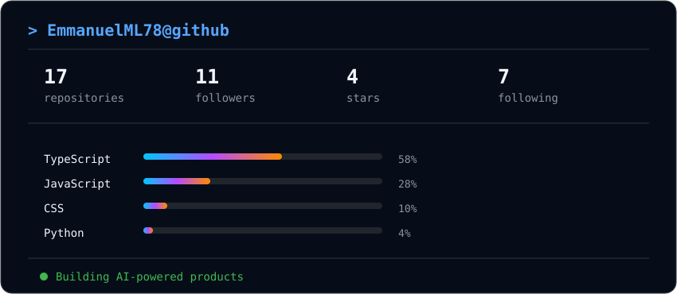

<p align="center">
  
</p>

<h1 align="center">Emmanuel Medina</h1>

<p align="center">
  Full Stack Developer · AI Builder · SaaS
</p>

<p align="center">📍 Medellín, Colombia</p>

<p align="center">
  <a href="https://emmanuel-iota.vercel.app/">Portfolio</a>
  ·
  <a href="https://github.com/EmmanuelML78">GitHub</a>
</p>
<br>

## `> whoami`

```bash
emmanuel@github:~$ whoami

Full Stack Developer focused on building modern web applications,
SaaS products, AI agents and automation.

I enjoy turning ideas into real products — from frontend and backend
development to databases, deployments and AI integrations.
```

<br>

## `> tech_stack`

```ts
const emmanuel = {
  languages: ["TypeScript", "JavaScript", "Python"],

  frontend: ["React", "Next.js", "Vue", "Tailwind CSS"],

  backend: ["Node.js", "NestJS", "Express", "Django"],

  database: ["PostgreSQL", "Prisma", "MongoDB", "MySQL", "Firebase"],

  ai: ["Gemini", "Mastra", "AI SDK", "AI Agents", "Automation"],

  tools: ["Docker", "Git", "Vercel", "Railway", "GCP", "AWS"],

  currentFocus: "Building AI-powered products 🚀"
};
```

<br>

## `> featured_projects`

### 🧠 Lead Intelligence

AI-powered platform for analyzing conversations, scoring leads and
prioritizing commercial opportunities.

`Next.js` · `TypeScript` · `Bun` · `Prisma` · `PostgreSQL` · `Gemini`

**Highlights:** AI extraction · Hybrid scoring · Advisor assignment · Analytics

---

### 🤖 AI Production Agent

Conversational AI agent connected to Telegram for production
queries and automated reporting.

`Gemini` · `Mastra` · `AI SDK` · `NestJS` · `Telegram`

**Highlights:** AI Agents · Automation · Natural Language · SaaS Integration

---

### 🌱 Production SaaS

Full-stack SaaS platform for tracking avocado nursery production.

`Next.js` · `NestJS` · `PostgreSQL` · `Neon` · `Railway`

**Highlights:** Production tracking · Dashboards · Cloud deployment

---

### 📊 Commercial CRM

CRM platform for managing leads, opportunities and commercial workflows.

`Next.js` · `NestJS` · `PostgreSQL`

**Highlights:** Lead Management · Sales Workflows · Dashboards

<br>

## `> github_stats`

<p align="center">
  
</p>

## `> currently`

```yaml
location: Medellín, Colombia 🇨🇴

building:
  - SaaS products
  - AI agents
  - Web applications
  - Automation

learning:
  - AI engineering
  - Cloud architecture
  - English

interested_in:
  - Artificial Intelligence
  - Software Architecture
  - SaaS
  - Developer Tools
```

<br>

## `> connect`

<p align="center">
  <a href="https://emmanuel-iota.vercel.app/">
    Portfolio
  </a>
  ·
  <a href="https://github.com/EmmanuelML78">
    GitHub
  </a>
</p>

<br>

<p align="center">
  <code>Build useful things. Learn every day. Keep shipping.</code>
</p>
